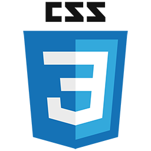

# Olá, me chamo Lucas 👋

 

Sou formado em TI e Análise e Desenvolvimento de Sistemas, tenho interesses em mineração de dados, desenvolvimento web, desenvolvimento de aplicativos mobile e desenvolvimento de jogos.

- 🔭 No momento estou procurando emprego na área de tecnologia

- 😎 Aqui você pode achar alguns trabalhos meus da faculdade e projetos pessoais como o [Fonostar](https://github.com/Luccwar/Fonostar-Android)

- 🤔 Por enquanto estou aprofundando meus conhecimentos sobre ***C#, Java e NodeJS***

- 🎮 Entusiasta de Design de Jogos

### Opções de Contato
Preferível:  
 **lucaz.05.x@hotmail.com**
 
 **[/lucasadosp](https://www.linkedin.com/in/lucasadosp/)**
   
Extras:  
 **lucaz.05.x@gmail.com**
 
 **lucwar**

### Tecnologias

  <h3>Créditos/Inspirações para o README</h3>

  <a href="https://github.com/abhisheknaiidu">Abhishek Naidu</a> e seu repositório <a href="https://github.com/abhisheknaiidu/awesome-github-profile-readme">awesome-github-profile-readme</a>  
  <a href="https://github.com/ai">Andrey Sitnik</a> e seu repositório <a href="https://github.com/ai/size-limit/tree/main">Size-Limit</a>  
  <a href="https://github.com/filiptronicek">Filip Troníček</a>  
  <a href="https://github.com/jonatasemidio">Jonatas Emidio</a> e seu repositório <a href="https://github.com/jonatasemidio/multilanguage-readme-pattern">multilanguage-readme-pattern</a>  
  <a href="https://github.com/matiassingers">Matias Singers</a> e seu repositório <a href="https://github.com/matiassingers/awesome-readme">Awesome-Readme</a> 
  <a href="https://github.com/laura-perera">Laura Perera</a>  
  <a href="https://github.com/Prof-Rodrigo-Silva">Rodrigo Silva</a>  

